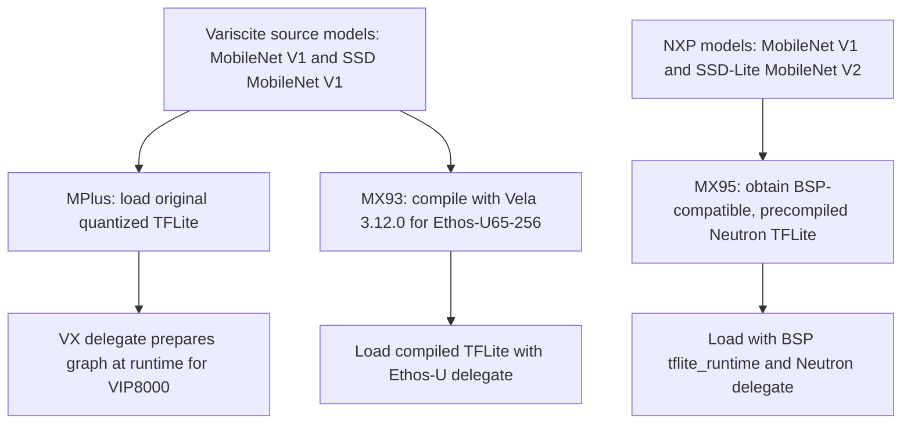
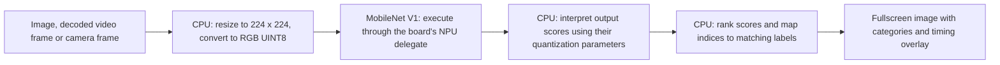
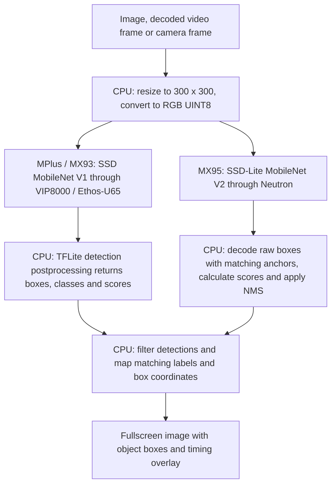

<picture>
  <source media="(prefers-color-scheme: dark)" srcset="https://nyc3.digitaloceanspaces.com/variscite-marketing/demos/branding/v1/variscite-logo-white.png">
  
</picture>

**Demos for Variscite System on Modules**

## Installing Variscite Demos

Run as root on the board:

```sh
curl -fsSL https://raw.githubusercontent.com/dorta/var-demos/demos/install.sh | sh
```

The board is detected automatically. To update, close the demos and repeat
the command.

## Running Variscite Demos

```sh
var-demos
```

Arrows to select, Enter to launch, Esc to return.

Choose a demo, then select the video or camera resolution when prompted.

For videos, choose **HD (720p)** or **Full HD (1080p)**, then **Buildings A**
or **Buildings B**. AI demos and the player use the same [two Freepik clips](ai-ml-demos/VIDEO_SOURCES.md),
with identical choices on all three SoMs.

| Category | Demos |
| --- | --- |
| [AI / ML](ai-ml-demos/) | Classification, detection and hand gestures |
| [Multimedia](multimedia-demos/) | Video player |
| [OpenCL](opencl/python/) | GPU computation |
| BSP | Graphical examples already installed in `/opt` |

## Board Support

| Demo | i.MX 8M Plus | i.MX 93 | i.MX 95 |
| --- | :---: | :---: | :---: |
| NPU | VIP8000 / VX | Ethos-U65 | Neutron |
| Camera classification | ✓ | ✓ | ✓ |
| Camera detection | ✓ | ✓ | ✓ |
| Image classification / detection | ✓ | ✓ | ✓ |
| 720p / 1080p classification | ✓ | ✓ | ✓ |
| 720p / 1080p detection | ✓ | ✓ | ✓ |
| Video player | ✓ | ✓ | ✓ |
| OpenCL / GPU examples | ✓ | N/A | ✓ |
| Hand gestures | Experimental | N/A | N/A |

✓ means tested on the connected boards. N/A means not enabled. This does not certify
continuous operation. MX93 uses CPU-decoded MJPEG, not H.264.
Both buildings clips are available in 720p and 1080p; 720p is the default.

| Camera capture choice | i.MX 8M Plus | i.MX 93 | i.MX 95 |
| --- | :---: | :---: | :---: |
| VGA 640×480 | ✓ | ✓ (default) | ✓ |
| SD 720×480 | ✓ (default) | N/A | N/A |
| HD 1280×720 | ✓ | ✓ | ✓ (default) |
| Full HD 1920×1080 | ✓ | ✓ | ✓ |

These choices were checked with the connected OV5640 cameras for both
classification and detection. They are capture modes, not a promise of
30 FPS at every resolution or compatibility with other sensors.

## Models and Conversion

Classification identifies the image's main category. Detection finds objects
and draws boxes around them.

| Model Detail | i.MX 8M Plus | VAR-SOM-MX93 | DART-MX95 |
| --- | --- | --- | --- |
| NPU | VeriSilicon VIP8000 | Arm Ethos-U65-256 | NXP Neutron |
| Delegate | VX | Ethos-U | Neutron |
| Classification Model | MobileNet V1 1.0 | MobileNet V1 1.0 | MobileNet V1 1.0 |
| Classification Input | RGB, 224×224, UINT8 | RGB, 224×224, UINT8 | RGB, 224×224, UINT8 |
| Classification Output | UINT8 scores | UINT8 scores | FLOAT32 scores |
| Detection Model | SSD MobileNet V1 | SSD MobileNet V1 | SSD-Lite MobileNet V2 |
| Detection Input | RGB, 300×300, UINT8 | RGB, 300×300, UINT8 | RGB, 300×300, UINT8 |
| Detection Output | FLOAT32 boxes and scores | FLOAT32 boxes and scores | FLOAT32 raw boxes and scores |
| Model Source | Original Variscite demos | Same source models as MPlus | NXP precompiled models |
| Preparation | Graph prepared at runtime | Compiled with Vela 3.12.0 | Already compiled for Neutron |

**Data types:** UINT8 means unsigned 8-bit integers, not signed INT8.
FLOAT32 means 32-bit floating-point values. A 720p or 1080p video is resized
to the model input size above before inference.

**Shared models:** MPlus and MX93 use the same source models. Recompiling
them with Vela reproduced the installed MX93 artifacts byte-for-byte.

**MX95 differences:** its detector is a different model and requires CPU
box decoding/NMS. Its classifier has the same architecture, but identical
weights and preprocessing are not established. The NXP artifacts come from
`lf-6.18.20_2.0.0`; they were not compiled locally with the current SDK.

See [Model Sources and Conversion](CONVERTING_MODELS.md) for download links,
checksums, quantization parameters and conversion commands.

### Where the Models Come From

This suite does not train new models. It installs existing models and prepares
them for the board's NPU. Compilation changes the execution artifact; it
does not mean training a new network.

| Task | MPlus and MX93 Source | MX95 Source | Same Model on All Three? |
| --- | --- | --- | --- |
| Classification | Variscite MobileNet V1 1.0 | NXP MobileNet V1 1.0 | Same architecture, but identical weights and preprocessing are not established for MX95 |
| Detection | Variscite SSD MobileNet V1 | NXP SSD-Lite MobileNet V2 | No. MPlus and MX93 share one source detector; MX95 uses a different detector |

There are **two source detectors, not three independently trained detectors**.
The MPlus and MX93 files differ because their NPU execution paths differ.
The original Variscite models' exact earlier training/export recipe has not
been recovered. The MX95 artifacts are supplied by NXP in
`lf-6.18.20_2.0.0`; we did not compile them locally with the current SDK.
Exact source links, filenames and checksums are in the
[model provenance guide](CONVERTING_MODELS.md#exact-installed-artifacts-and-provenance).

### Model Preparation Flow

This flow applies to both classification and detection. All installed model
files have a `.tflite` extension, but they are not interchangeable between NPUs.



For MX93, the recorded Vela command is
`vela <source-model>.tflite --accelerator-config ethos-u65-256 --output-dir output`.
The reproduced classifier and detector match the installed compiled artifacts
byte-for-byte. VX preparation happens when the MPlus model is first invoked;
it is not a Vela conversion. MX95 uses the NXP-precompiled artifacts rather
than a conversion of the MPlus detector.

### Image, Video and Camera Input Flow

All three input types feed the same task-specific model on each board:

| Input | How Frames Reach the Demo |
| --- | --- |
| Image file | CPU reads the selected still image; no video decoder is needed |
| Video file | GStreamer decodes the selected HD or Full HD clip using the board-specific path below |
| Camera | V4L2 captures frames at the selected camera resolution; no compressed-file decoder is needed |

| SoM | Video File and Decoder | Image Conversion / Scaling |
| --- | --- | --- |
| i.MX 8M Plus | H.264 MP4; `v4l2h264dec`, hardware decoding | `imxvideoconvert_g2d`, using G2D hardware |
| VAR-SOM-MX93 | MJPEG AVI; `jpegdec`, CPU decoding | `imxvideoconvert_pxp`, using PXP hardware |
| DART-MX95 | H.264 MP4; `v4l2h264dec`, hardware decoding | OpenGL/EGL conversion with `glupload`, `glcolorconvert` and `gldownload` |

**AVI, MJPEG and PXP are different things:** AVI is the file container,
MJPEG is the video compression inside it, and PXP is an image-processing
hardware block. On MX93, the CPU decodes MJPEG; PXP converts/scales the
decoded images. PXP is neither a video decoder nor the inference NPU.
This is a compatibility adaptation for the installed BSP, with larger files
and CPU decoding costs compared with the H.264 paths.

The [two supplied Freepik clips](ai-ml-demos/VIDEO_SOURCES.md) are the same
content on all boards. MX93 uses converted MJPEG copies; MX95 uses H.264
compatibility copies without B-frames. Video conversion is separate from
model compilation.

MPlus and MX93 video inference can first scale decoded frames to a
display-sized working image with G2D/PXP. The CPU then resizes that image
to the model input. MX95 inference currently keeps its validated native-frame
conversion path by default; accelerated working-size scaling remains
experimental. The player has its own display-scaling path and does not run
an AI model. These differences affect full-pipeline FPS.

### Classification Flow

Classification answers **“What is the main category in this image?”** It
produces category scores, not object boxes. For video and camera, this flow
is repeated for each processed frame.



MPlus/MX93 classifiers return quantized UINT8 scores; MX95 returns FLOAT32
scores. Their input quantization parameters also differ. A common architecture
or UINT8 input does not prove identical predictions.

### Detection Flow

Detection answers **“Which objects are present, and where are they?”** It
produces boxes, categories and confidence scores. The network computation
uses the NPU, but detection postprocessing and drawing still use the CPU.



NMS (non-maximum suppression) removes overlapping duplicate detections.
MX95 must use its matching NXP anchors and COCO labels, not the MPlus
postprocessor. Source videos can be 720p or 1080p, but the detector still
receives 300×300 inputs. Display size, video size and model input size are
three separate dimensions.

**Comparing boards:** inference time measures model execution, not the
entire decoder, preprocessing and display path. MPlus/MX93 share source
models, while MX95 uses a different detector. The pipelines also differ,
so these demo FPS results are not a controlled comparison of NPU speed alone.

## Performance

The same scenarios appear in each SoM table, so missing measurements are
visible rather than omitted.

**Validation:** Measured = tested with recorded timing; Functional = works,
without reported timing; Experimental = needs further validation;
Not enabled = unavailable in this suite. **N/A** means no recorded value.

**FPS** measures processed frames per second, including capture, decoding
and drawing. **Inference** measures only model execution, in milliseconds.
Lower inference time does not necessarily mean higher video FPS.

MPlus and MX93 video results below use 200 visible frames of Buildings A
(25 FPS), with accelerated 800×450 working images on an 800×480 display.
These are short runs, not sustained-load guarantees. Thermal limiting can
reduce processing to 15 FPS; details are in the [validation record](ai-ml-demos/VALIDATION.md).

### i.MX 8M Plus

VIP8000 NPU. MobileNet V1 classification and SSD MobileNet V1 detection.

| Scenario | Source | Validation | Duration | FPS | Inference |
| --- | --- | --- | --- | ---: | ---: |
| Image classification | Sample image | Functional | N/A | N/A | N/A |
| Image detection | Sample image | Functional | N/A | N/A | N/A |
| 720p video classification | 720p H.264 | Measured | 8.29 s | 24.11 | 3.42 ms |
| 1080p video classification | 1080p H.264 | Measured | 8.34 s | 23.99 | 3.70 ms |
| Camera classification | Camera | Functional | N/A | N/A | N/A |
| Camera detection | 720×480 | Measured | 10 min | 15.76 | 9.00 ms |
| 720p video detection | 720p H.264 | Measured | 8.42 s | 23.74 | 9.00 ms |
| 1080p video detection | 1080p H.264 | Measured | 8.42 s | 23.75 | 9.21 ms |
| Video player | 720p H.264 | Functional | N/A | N/A | N/A |
| OpenCL / GPU examples | GPU | Functional | N/A | N/A | N/A |
| Hand gestures | Camera | Experimental | N/A | N/A | N/A |

### VAR-SOM-MX93

Ethos-U65 NPU. MobileNet V1 classification and SSD MobileNet V1 detection.

| Scenario | Source | Validation | Duration | FPS | Inference |
| --- | --- | --- | --- | ---: | ---: |
| Image classification | Sample image | Functional | N/A | N/A | N/A |
| Image detection | Sample image | Functional | N/A | N/A | N/A |
| 720p video classification | 720p MJPEG | Measured | 8.29 s | 24.11 | 4.15 ms |
| 1080p video classification | 1080p MJPEG | Measured | 8.29 s | 24.12 | 4.14 ms |
| Camera classification | 640×480 | Measured | 60 s | 29.98 | 4.12 ms |
| Camera detection | 640×480 | Measured | 60 s | 29.97 | 8.64 ms |
| 720p video detection | 720p MJPEG | Measured | 8.27 s | 24.19 | 9.33 ms |
| 1080p video detection | 1080p MJPEG | Measured | 8.35 s | 23.97 | 9.14 ms |
| Video player | 720p MJPEG | Functional | N/A | N/A | N/A |
| OpenCL / GPU examples | N/A | Not enabled | N/A | N/A | N/A |
| Hand gestures | N/A | Not enabled | N/A | N/A | N/A |

MJPEG is decoded on the CPU; this BSP has no H.264 decoder.

### DART-MX95

Neutron NPU. MobileNet V1 classification and SSD-Lite V2 detection.

| Scenario | Source | Validation | Duration | FPS | Inference |
| --- | --- | --- | --- | ---: | ---: |
| Image classification | Sample image | Functional | N/A | N/A | N/A |
| Image detection | Sample image | Functional | N/A | N/A | N/A |
| 720p video classification | 720p H.264 | Functional | N/A | N/A | N/A |
| 1080p video classification | 1080p H.264 | Functional | N/A | N/A | N/A |
| Camera classification | 1280×720 | Measured | 10 s | 5.90 | 1.40 ms |
| Camera detection | 1280×720 | Measured | 12 s | 5.83 | 3.72 ms |
| 720p video detection | 720p H.264 | Functional | N/A | N/A | N/A |
| 1080p video detection | 1080p H.264 | Functional | N/A | N/A | N/A |
| Video player | 720p H.264 | Functional | N/A | N/A | N/A |
| OpenCL / GPU examples | GPU | Functional | N/A | N/A | N/A |
| Hand gestures | N/A | Not enabled | N/A | N/A | N/A |

The previous Full HD timing was withdrawn: its GL conversion delivered
black frames. The corrected path was checked with visible detections;
representative sustained video timings must be measured again. Thermal
pauses still occur around 82 °C; camera throughput is limited by capture.
The final video path explicitly uses MMAP decoder buffers before GPU
conversion; automatic DMA_DRM import produced out-of-order image content
even with increasing timestamps. See the [validation record](ai-ml-demos/VALIDATION.md).

These are existing validation results, not one standardized benchmark.
Different camera resolutions, models, codecs, durations and temperatures
prevent a fair speed ranking. Uniform-duration comparative measurements
are still pending; multi-hour stability is not certified.

[Camera and video details](ai-ml-demos/camera-vision/) ·
[Model conversion](CONVERTING_MODELS.md)

Models and media are stored on DigitalOcean Spaces and verified with
SHA-256. No Git LFS.
