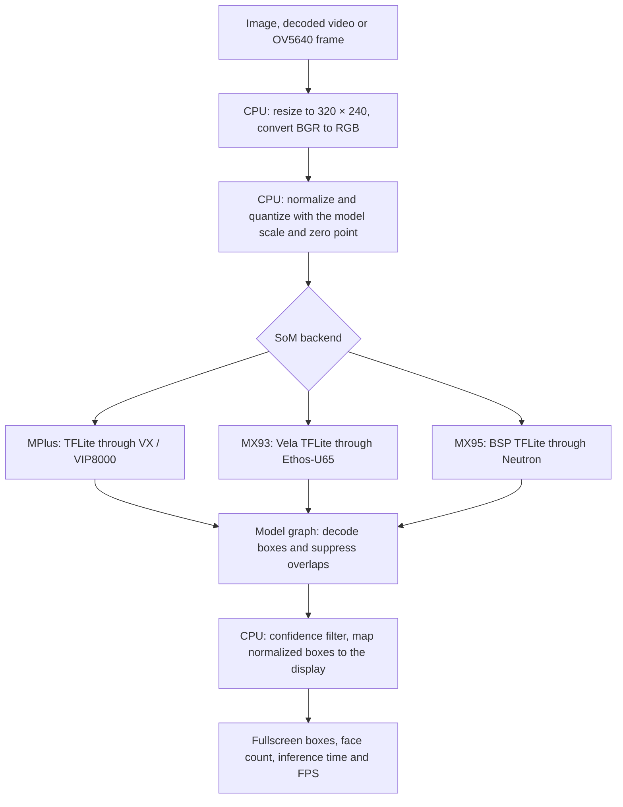

# Face Detection

[Documentation](README.md) · [SoM Support](som-support.md)

UltraFace Slim finds faces and draws boxes. It does not identify people
or recognize emotions. Image, video and camera modes use the same runner
and display layout on all three SoMs.

## Running the Demo

Open `var-demos`, select **AI / ML**, then **Face Detection**. Inside that
task, choose **Image**, **Video** or **Camera**. The NPU appears in the menu
header rather than demo names. Demos open fullscreen; Esc
returns to the menu. Video mode offers HD and Full HD, then City Selfie.
Camera mode asks for a capture resolution.
All camera demos, including experimental hand gestures, use the SoM's
camera-resolution selector. A fixed **CAMERA** panel below FPS shows the
selected capture width and height, not the resized working frame or model
tensor. It has the same position and dimensions as the **VIDEO** panel.

From `/opt/var-demos/ai-ml/camera-vision`, direct execution is:

```sh
python3 demo.py --task face --image media/face-image.jpg
python3 demo.py --task face --video assets/videos/face_1117992_1280x720.mp4
python3 demo.py --task face --resolution 1280x720
```

Use the `.avi` copy on MX93. Cameras default to `/dev/video4` on MPlus
and `/dev/video0` on MX93/MX95. Only the tested OV5640/carrier configuration
is configured, not arbitrary USB/MIPI sensors. `--threshold` accepts 0 to
1, default 0.5. `--seconds` bounds a run; `--headless` omits its window.

## Model and NPU Preparation

| Detail | i.MX 8M Plus | VAR-SOM-MX93 | DART-MX95 |
| --- | --- | --- | --- |
| Detector | UltraFace Slim | UltraFace Slim | UltraFace Slim |
| NPU | VIP8000 | Ethos-U65-256 | Neutron |
| Delegate | VX | Ethos-U | Neutron |
| Input | RGB UINT8, 320×240 | RGB UINT8, 320×240 | RGB UINT8, 320×240 |
| Input scale / zero point | 1/128 / 127 | 1/128 / 127 | 1/128 / 127 |
| Output | FLOAT32 face scores and boxes | FLOAT32 face scores and boxes | FLOAT32 face scores and boxes |
| Preparation | VX prepares the quantized graph at runtime | BSP Vela 3.12.0 compilation | Matching NXP BSP release's precompiled artifact |

The source and Neutron artifacts come from the
[NXP assets release LF6.18.20_2.0.0](https://github.com/nxp-imx-support/nxp-demo-experience-assets/tree/0dae5d8f308bcca514d215fb3b7bc0980cc0c6d9/models).
The source implementation is
[Ultra-Light-Fast-Generic-Face-Detector-1MB](https://github.com/Linzaer/Ultra-Light-Fast-Generic-Face-Detector-1MB).
NXP also provides a [model card and conversion recipe](https://huggingface.co/nxp/ultraface-slim-imx).
Its newer artifacts are not automatically compatible with our BSPs.

MPlus and MX93 use exactly the same verified source file, compiled with
Vela for MX93. MX95 uses the paired artifact from the same NXP release.
Its conversion was not reproduced locally, so byte-identical weights or
outputs across all three backends are not claimed. Actual NPU delegation
was checked; CPU postprocessing remains present. The Neutron SDK 3.1.3
candidate issued a mismatch against our driver 3.1.2 and was rejected.
The selected artifact delegated two Neutron partitions without that warning.

| Installed Artifact | SHA-256 |
| --- | --- |
| `ultraface.tflite` | `6d47a446337a9d9d10fa16d4133e976c1d56d84b4a46225ba60352e6fab0d3dd` |
| `ultraface_vela.tflite` | `22c836ec31a605b1ac8ae71007437f0a3d88857b3b4a179caf664084af7f4635` |
| `ultraface_neutron.tflite` | `1d1c97369b6b6d4f1a993e9764d1dc0121ce33c32481331ad32ac47d40e32fa9` |

To reproduce the MX93 artifact with Vela **3.12.0**:

```sh
vela ultraface.tflite --accelerator-config ethos-u65-256 --output-dir output
```

The [reproduction helper](../ai-ml-demos/camera-vision/prepare_face.py)
checks the source, compiler version and compiled checksum. The installer
downloads the verified compiled artifact; users do not need to run Vela.
The compiler report records 98 NPU and five CPU operators, not a wall-time ratio.

## Frame Processing Flow



Input represents `(RGB − 127) / 128`, then uses the declared quantization.
With the recorded scale/zero point, the resulting UINT8 input equals the
original RGB bytes. Tests check this equivalence. Output rows contain
background score, face score and normalized `x0,y0,x1,y1`. Model-internal
NMS is not repeated by the overlay. Timed `invoke()` includes the CPU tail
and NPU partitions; it is not an isolated NPU-only time.

Video decode, resize, drawing and display add costs. Face boxes use the
shared palette and a fixed face-count panel, without large overlapping
labels above small adjacent faces.

## Video and Camera Input

City Selfie is the supplied clip `1117992` in 1280×720 and 1920×1080,
both 41.24 seconds at 25 FPS. Only face menus use this clip; the other
demos retain Buildings A/B. Original files were not modified.

| SoM | Installed Clip | Decode and Display Preparation |
| --- | --- | --- |
| MPlus | Original H.264 MP4 | Hardware decoder and G2D |
| MX93 | MJPEG AVI compatibility copy | CPU JPEG decoder and PXP |
| MX95 | H.264 MP4 copy without B-frames | Hardware MMAP NV12 decoder and GPU conversion |

See [Video Sources](video-sources.md) for conversion and license details.
Video resolution is independent of the 320×240 model input and 800×480
display. Camera mode sets capture resolution, not just window size.
Face-camera conversion uses G2D on MPlus and PXP on MX93 before handing
display-sized BGR pixels to the CPU. The configured sensor resolution
remains the selected capture mode. MX95 retains its existing camera path;
the sensor must initialize successfully before further camera acceleration
can be validated. Thermal safeguards remain enabled.

The shared policy reads recognized SoC zones and kernel thermal trip points.
It pauses at least 3 C before a passive trip and 10 C before a reported
critical trip, with an additional application ceiling of 95 C. The warm
threshold is 2 C below pause; resume is 4 C below pause. For the tested
kernels this gives MPlus 80/82/78 C, MX93 88/90/86 C and MX95 93/95/91 C
(warm/pause/resume). Missing policy data keeps the conservative 80/82/78 C
fallback. Driver-reported throttling still pauses at any temperature.
These are application choices, not vendor operating-temperature ratings.
Kernel protections and trip points are not changed. The terminal manager
uses the same thresholds as the demo, rather than reporting false cooling.

## Validation Limits

Complete City Selfie runs used the publicly downloaded, checksum-verified
HD and Full HD copies, visible fullscreen windows and real NPU invocation:

| SoM | Video | Frames Processed | Processed FPS | Mean Invoke | Peak Sampled SoC |
| --- | --- | ---: | ---: | ---: | ---: |
| MPlus | HD | 679 | 16.36 | 5.56 ms | 80.0 C |
| MPlus | Full HD | 623 | 12.53 | 5.66 ms | 81.0 C |
| MX93 | HD | 951 | 23.07 | 7.11 ms | 62.35 C |
| MX93 | Full HD | 945 | 22.90 | 7.23 ms | 65.35 C |
| MX95 | HD | 1026 | 24.87 | 4.25 ms | 83.0 C |
| MX95 | Full HD | 1027 | 19.88 | 4.21 ms | 88.12 C |

Each run detected up to four faces in a frame. Some frames contain background
passersby in addition to the foreground face. MPlus reached its unchanged
warm limit and reduced processing to 15 FPS. MX93/MX95 did not reach their
new warm/pause thresholds. Full HD on MX95 still costs more than its small
model invocation: native-frame decoder/GPU transfer and display processing
remain in the path. These runs do not claim all-frame accuracy or benchmark
equivalence across codecs. The file clock and backpressure can make a
slower run last longer than the nominal 41.24-second clip.

The reference image produced 14 faces on each NPU in an 800×480 fullscreen
window. Visible HD/Full HD processing was tested separately from model
invocation. Short runs do not certify continuous operation, accuracy on
all faces or 30 FPS. The supplied videos contain 25 frames per second.

MX95 camera validation currently cannot complete: its kernel reported
OV5640 `failed to power on`, probe error `-5`, and no `/dev/media0`.
Image/video are independent of this sensor failure. A working camera must
be connected and initialized before this mode can be validated. The demo
reports a missing controller rather than claiming successful capture.

Models and media are published on DigitalOcean Spaces, SHA-256 verified,
and not committed as binaries. The installer includes MIT code/model
license files from NXP's model distribution. Its reference image is
identified there as NASA/public domain. The video's original page/license
was not supplied; no independent license verification is claimed. Model
licenses do not license videos.
