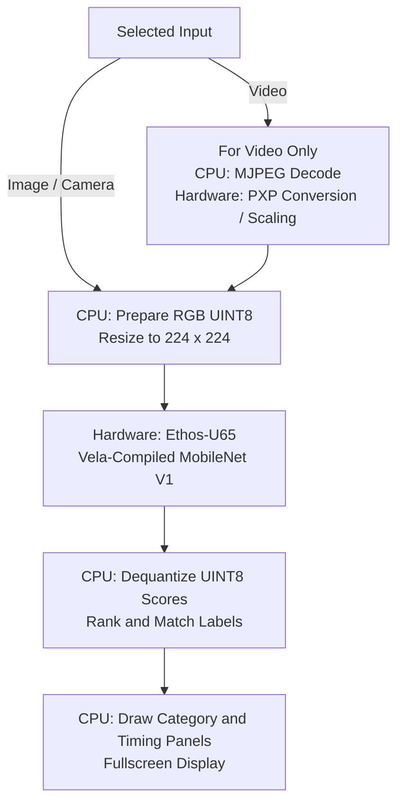
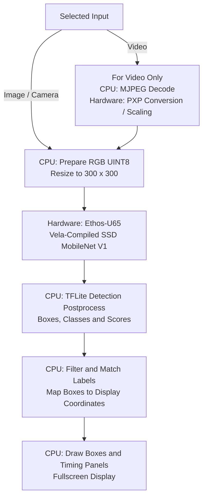

# Ethos-U65 on VAR-SOM-MX93

[Documentation](../README.md) · [NPU Guides](README.md) · [Project Overview](../../README.md)

## What This Runtime Expects

### Face Detection

UltraFace image, video and camera modes use RGB UINT8 input at 320×240,
with scale 1/128 and zero point 127. The same source as MPlus is compiled with Vela 3.12.0 for Ethos-U65-256.
The model graph produces FLOAT32 face scores and normalized boxes; its
postprocessing still uses CPU operations. Frame acquisition, resize and
quantization precede the Ethos-U65 invocation; confidence filtering
and display-coordinate mapping follow it. See [Face Detection](../face-detection.md)
for the complete flow, artifact checksums and current validation limits.

### NPU and Libraries

Ethos-U65 accelerates tensor operations under Cortex-M33 firmware control.
The [NXP ML guide](https://www.nxp.com/docs/en/user-guide/UG10166.pdf)
(sections 2.2.4 and 8.2) describes this stack:

| Layer | Library / Component |
| --- | --- |
| Model execution | TensorFlow Lite / `tflite_runtime` |
| Delegation | `libethosu_delegate.so` |
| Device access | Ethos-U userspace and kernel drivers |
| NPU control | RPMsg and Cortex-M33 Ethos-U firmware |
| Offline preparation | Vela compiler |

### Installed Models

| Requirement | Installed Demo Configuration |
| --- | --- |
| Artifact | Vela-compiled TFLite containing an Ethos-U subgraph |
| Delegate | `/usr/lib/libethosu_delegate.so` |
| Classification File | `mobilenet_vela.tflite` |
| Detection File | `ssd_vela.tflite` |
| Inputs | UINT8 RGB: classification 224×224, detection 300×300. Both inputs use scale 0.0078125 and zero point 128. |
| Outputs | Classification: 1001 UINT8 scores. Detection: FLOAT32 boxes, class indices, confidence scores and count after CPU detection postprocessing. |

The same source classifier and detector as MPlus, compiled with Vela 3.12.0 for Ethos-U65-256. Recorded conversions reproduced both installed artifacts byte-for-byte.

These tensor types describe the installed models, not every type this NPU
could support. A model needs compatible operators, quantization and runtime;
its suffix or input resolution alone is insufficient.

## Starting a Demo

1. Install the suite using the [root instructions](../../README.md#installing-variscite-demos).
2. Run `var-demos`, choose **AI / ML**, then **Classification** or **Detection**.
3. Choose **Image**, **Video** or **Camera**. Video selection asks for HD/Full HD,
   then Buildings A/B. Camera selection asks for a capture resolution.
4. The manager launches the Ethos-U65 entry. The runtime loads its model,
   matching labels and delegate, allocates tensors and performs an untimed
   warmup before measuring steady inference.
5. Frames are processed and shown fullscreen. Thermal protection can limit or
   pause processing; on MX93/MX95, a hot-start check runs before model/decoder
   initialization. Press Esc to stop and return to the menu.

Warmup is model preparation, not video playback. Cold startup can take longer
than subsequent inference. Do not interpret a thermal pause as compilation.

## Obtaining Each Frame

MJPEG AVI file: CPU jpegdec, then PXP hardware scaling/conversion; image file: CPU image reader; camera: V4L2 capture.

Only compressed video files need a decoder. Image and camera inputs join the
flows below after frame acquisition. For a video, the decoder/converter stage
runs before the CPU model resize. Hardware-assisted working-size scaling can
add a resampling stage without changing model dimensions.

## Classification Flow

The result is the main image category, not a list of located objects.

Image/camera frames skip the video-only stage. The selected source dimensions
do not change the classifier's 224×224 input.

## Detection Flow

The result contains object positions, labels and confidence scores.

Image/camera frames skip the video-only stage. Box coordinates must map back
to the displayed scene rather than remain in the 300×300 model coordinate space.

## Hardware Versus Software

| Stage | Execution |
| --- | --- |
| Compressed Video Input | CPU: MJPEG Decode; Hardware: PXP Conversion / Scaling |
| Final Model Resize / RGB Preparation | CPU software |
| Supported Neural-Network Graph | Dedicated Ethos-U65 hardware via its software delegate |
| Scores, Labels, Detection Postprocessing | CPU software |
| Drawing Boxes and Panels | CPU software; the display stack presents the resulting image |

The installed stack also needs the Ethos-U device/driver and matching Cortex-M33 firmware. PXP accelerates image manipulation, not MJPEG decoding or model inference. The recorded Vela SSD partition has one CPU detection-postprocessing operator; loading the NPU delegate does not move that operator to the NPU.

The decoder, image engine/GPU and NPU are different accelerators. They do not
make the whole application hardware-only. CPU libraries can still use SIMD;
unsupported model operators may stay on CPU. Check delegation logs rather
than assuming every operator was accelerated.

## Conversion and Further Reading

DeepLabV3 semantic masks use BSP Vela 3.12.0 with `ethos-u65-256`, not the
512-MAC setting in NXP's newer recipe. Image/video/camera modes remain
experimental. See [Segmentation](../segmentation.md) for the full frame flow.

[Arm Vela documentation](https://gitlab.arm.com/artificial-intelligence/ethos-u/ethos-u-vela/-/blob/main/README.md) and the [NXP ML guide](https://www.nxp.com/docs/en/user-guide/UG10166.pdf), Ethos-U sections. For the reproduced command and compiler settings, use [our conversion record](../model-conversion.md#imx-93).

- [Our exact conversion/provenance record](../model-conversion.md#imx-93).
- [Hardware specifications and official sources](../hardware.md#var-som-mx93).
- [Our demo benchmark results](../performance.md#var-som-mx93).
- [Compared models and shared flows](../models.md).
- [Runtime implementation](../../ai-ml-demos/camera-vision/demo.py).
