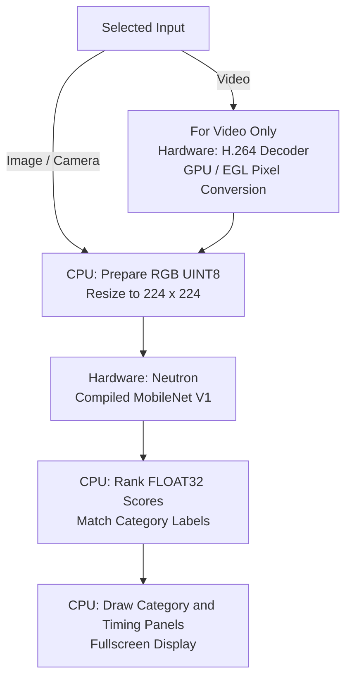
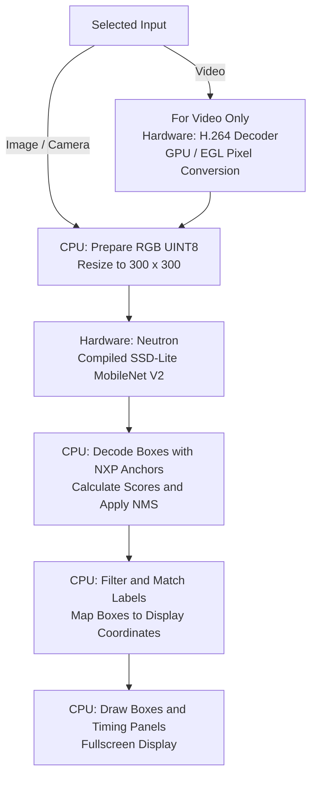

# Neutron on DART-MX95

[Documentation](../README.md) · [NPU Guides](README.md) · [Project Overview](../../README.md)

## What This Runtime Expects

### Face Detection

UltraFace image, video and camera modes use RGB UINT8 input at 320×240,
with scale 1/128 and zero point 127. The precompiled UltraFace artifact is paired with the tested NXP BSP release and driver 3.1.2.
The model graph produces FLOAT32 face scores and normalized boxes; its
postprocessing still uses CPU operations. Frame acquisition, resize and
quantization precede the Neutron invocation; confidence filtering
and display-coordinate mapping follow it. See [Face Detection](../face-detection.md)
for the complete flow, artifact checksums and current validation limits.

### NPU and Libraries

Neutron-S combines neural compute, a data mover and a RISC-V controller.
The [NXP ML guide](https://www.nxp.com/docs/en/user-guide/UG10166.pdf)
(sections 2.2.5 and 8.4) describes this stack:

| Layer | Library / Component |
| --- | --- |
| Model execution | TensorFlow Lite / `tflite_runtime` |
| Delegation | `libneutron_delegate.so` |
| Device access | Neutron userspace driver and Linux kernel driver |
| NPU control | Neutron firmware / microcode |
| Offline preparation | eIQ Toolkit Neutron converter |

### Installed Models

| Requirement | Installed Demo Configuration |
| --- | --- |
| Artifact | BSP-compatible Neutron-compiled TFLite containing a Neutron graph |
| Delegate | `/usr/lib/libneutron_delegate.so` |
| Classification File | `mobilenet_neutron.tflite` |
| Detection File | `ssd_neutron.tflite` |
| Inputs | UINT8 RGB: classification 224×224, detection 300×300. Input scale is approximately 1/255 with zero point 0. |
| Outputs | Classification: 1001 FLOAT32 scores. Detection: FLOAT32 raw box encodings [1,1917,1,4] and class scores [1,1917,91], requiring matching anchors and CPU decoding/NMS. |

NXP artifacts from lf-6.18.20_2.0.0, already compiled for Neutron. Classification uses MobileNet V1; detection uses SSD-Lite MobileNet V2, not the MPlus/MX93 detector. Current-SDK local conversion is not yet validated.

These tensor types describe the installed models, not every type this NPU
could support. A model needs compatible operators, quantization and runtime;
its suffix or input resolution alone is insufficient.

## Starting a Demo

1. Install the suite using the [root instructions](../../README.md#installing-variscite-demos).
2. Run `var-demos`, choose **AI / ML**, then **Classification** or **Detection**.
3. Choose **Image**, **Video** or **Camera**. Video selection asks for HD/Full HD,
   then Buildings A/B. Camera selection asks for a capture resolution.
4. The manager launches the Neutron entry. The runtime loads its model,
   matching labels and delegate, allocates tensors and performs an untimed
   warmup before measuring steady inference.
5. Frames are processed and shown fullscreen. Thermal protection can limit or
   pause processing; on MX93/MX95, a hot-start check runs before model/decoder
   initialization. Press Esc to stop and return to the menu.

Warmup is model preparation, not video playback. Cold startup can take longer
than subsequent inference. Do not interpret a thermal pause as compilation.

## Obtaining Each Frame

H.264 file: hardware v4l2h264dec with MMAP NV12 buffers, then GPU/EGL conversion; image file: CPU image reader; camera: V4L2 capture.

Only compressed video files need a decoder. Image and camera inputs join the
flows below after frame acquisition. For a video, the decoder/converter stage
runs before the CPU model resize. Hardware-assisted working-size scaling can
add a resampling stage without changing model dimensions.

## Classification Flow

The result is the main image category, not a list of located objects.

Image/camera frames skip the video-only stage. The selected source dimensions
do not change the classifier's 224×224 input.

## Detection Flow

The result contains object positions, labels and confidence scores.

Image/camera frames skip the video-only stage. Box coordinates must map back
to the displayed scene rather than remain in the 300×300 model coordinate space.

## Hardware Versus Software

| Stage | Execution |
| --- | --- |
| Compressed Video Input | Hardware: H.264 Decoder; GPU / EGL Pixel Conversion |
| Final Model Resize / RGB Preparation | CPU software |
| Supported Neural-Network Graph | Dedicated Neutron hardware via its software delegate |
| Scores, Labels, Detection Postprocessing | CPU software |
| Drawing Boxes and Panels | CPU software; the display stack presents the resulting image |

Use the BSP's tflite_runtime and compatible delegate/driver/microcode. An older converted artifact had a microcode mismatch; switching to ai_edge_litert also failed on the tested image. Neither is the selected path. GPU conversion is hardware acceleration, but the subsequent model resize and raw-box decoding/NMS are CPU software. Native-frame conversion remains the default; working-size EGL scaling is experimental until cooled retests pass.

The decoder, image engine/GPU and NPU are different accelerators. They do not
make the whole application hardware-only. CPU libraries can still use SIMD;
unsupported model operators may stay on CPU. Check delegation logs rather
than assuming every operator was accelerated.

## Conversion and Further Reading

DeepLabV3 segmentation uses the same source model as MPlus/MX93, locally
compiled with Neutron Converter 3.1.2 for the installed driver. Six Neutron
partitions execute on the NPU; XNNPACK accelerates the remaining CPU tail with
six threads. Image, video and camera entries follow face detection.
The earlier 3.1.3 candidate remains rejected. See [Segmentation](../segmentation.md)
for reproduction and [Profiling](../segmentation-profiling.md) for measured costs.

[Variscite Neutron conversion tutorial](https://dev.variscite.com/dart-mx95/mx95-yocto-walnascar-6.12.49_2.2.0-v1.0/machine-learning/) demonstrates eIQ Toolkit offline conversion. It targets a Walnascar BSP, not the tested Wrynose image: do not copy that release's converter unchanged. Use the [NXP ML guide](https://www.nxp.com/docs/en/user-guide/UG10166.pdf) and toolkit version matching the installed BSP.

- [Our exact conversion/provenance record](../model-conversion.md#imx-95).
- [Hardware specifications and official sources](../hardware.md#dart-mx95).
- [Our demo benchmark results](../performance.md#dart-mx95).
- [Compared models and shared flows](../models.md).
- [Runtime implementation](../../ai-ml-demos/camera-vision/demo.py).
