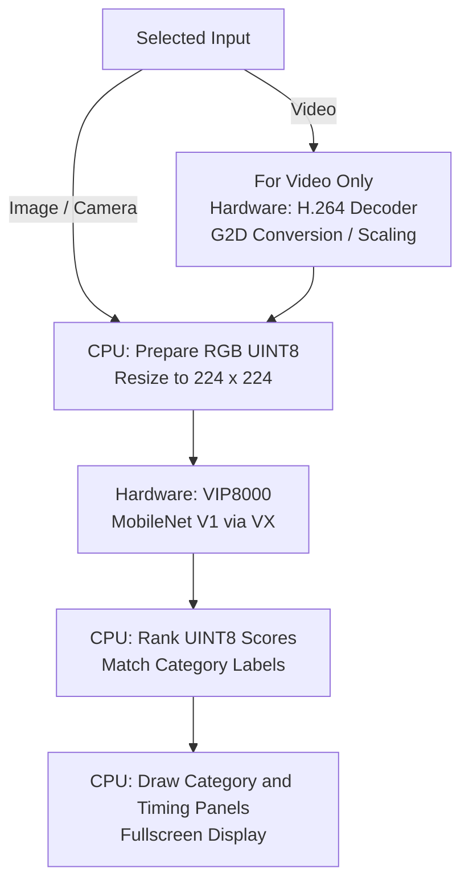
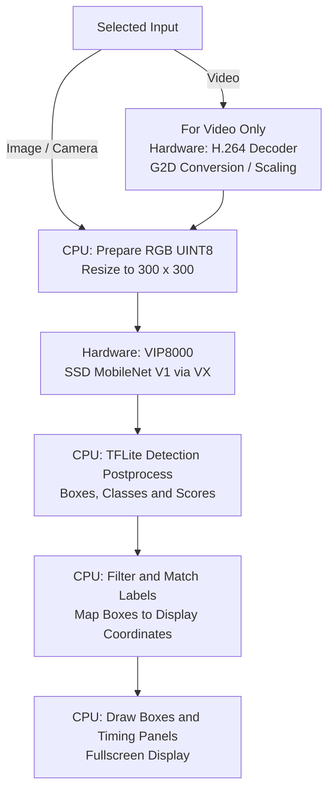

# VIP8000 on i.MX 8M Plus

[Documentation](../README.md) · [NPU Guides](README.md) · [Project Overview](../../README.md)

## What This Runtime Expects

### Face Detection

UltraFace image, video and camera modes use RGB UINT8 input at 320×240,
with scale 1/128 and zero point 127. The verified source TFLite graph is prepared by VX at runtime.
The model graph produces FLOAT32 face scores and normalized boxes; its
postprocessing still uses CPU operations. Frame acquisition, resize and
quantization precede the VX / VIP8000 invocation; confidence filtering
and display-coordinate mapping follow it. See [Face Detection](../face-detection.md)
for the complete flow, artifact checksums and current validation limits.

### NPU and Libraries

VIP8000 is the dedicated neural-network accelerator, separate from the GPU.
The [NXP ML guide](https://www.nxp.com/docs/en/user-guide/UG10166.pdf)
(sections 2.2.3 and 8.1) describes this stack:

| Layer | Library / Component |
| --- | --- |
| Model execution | TensorFlow Lite / `tflite_runtime` |
| Delegation | `libvx_delegate.so` |
| Graph backend | TIM-VX / OpenVX |
| Hardware access | GPU/NPU driver stack |

XNNPACK is a CPU backend, not proof of NPU use. The default VX hardware
selection is NPU; `USE_GPU_INFERENCE=1` changes that selection to GPU.

### Installed Models

| Requirement | Installed Demo Configuration |
| --- | --- |
| Artifact | Quantized TFLite with operations supported by VX |
| Delegate | `/usr/lib/libvx_delegate.so` |
| Classification File | `mobilenet_v1_1.0_224_quant.tflite` |
| Detection File | `ssd_mobilenet_v1_1_default_1.tflite` |
| Inputs | UINT8 RGB: classification 224×224, detection 300×300. Both inputs use scale 0.0078125 and zero point 128. |
| Outputs | Classification: 1001 UINT8 scores. Detection: FLOAT32 boxes, class indices, confidence scores and count after TFLite detection postprocessing. |

Original Variscite quantized TFLite; VX prepares supported graph operations at runtime. No Vela or Neutron offline conversion is used.

These tensor types describe the installed models, not every type this NPU
could support. A model needs compatible operators, quantization and runtime;
its suffix or input resolution alone is insufficient.

## Starting a Demo

1. Install the suite using the [root instructions](../../README.md#installing-variscite-demos).
2. Run `var-demos`, choose **AI / ML**, then **Classification** or **Detection**.
3. Choose **Image**, **Video** or **Camera**. Video selection asks for HD/Full HD,
   then Buildings A/B. Camera selection asks for a capture resolution.
4. The manager launches the VIP8000 entry. The runtime loads its model,
   matching labels and delegate, allocates tensors and performs an untimed
   warmup before measuring steady inference.
5. Frames are processed and shown fullscreen. Thermal protection can limit or
   pause processing; on MX93/MX95, a hot-start check runs before model/decoder
   initialization. Press Esc to stop and return to the menu.

Warmup is model preparation, not video playback. Cold startup can take longer
than subsequent inference. Do not interpret a thermal pause as compilation.

## Obtaining Each Frame

H.264 file: hardware decoder plus G2D conversion/scaling; image file: CPU image reader; camera: V4L2 capture.

Only compressed video files need a decoder. Image and camera inputs join the
flows below after frame acquisition. For a video, the decoder/converter stage
runs before the CPU model resize. Hardware-assisted working-size scaling can
add a resampling stage without changing model dimensions.

## Classification Flow

The result is the main image category, not a list of located objects.

Image/camera frames skip the video-only stage. The selected source dimensions
do not change the classifier's 224×224 input.

## Detection Flow

The result contains object positions, labels and confidence scores.

Image/camera frames skip the video-only stage. Box coordinates must map back
to the displayed scene rather than remain in the 300×300 model coordinate space.

## Hardware Versus Software

| Stage | Execution |
| --- | --- |
| Compressed Video Input | Hardware: H.264 Decoder; G2D Conversion / Scaling |
| Final Model Resize / RGB Preparation | CPU software |
| Supported Neural-Network Graph | Dedicated VIP8000 hardware via its software delegate |
| Scores, Labels, Detection Postprocessing | CPU software |
| Drawing Boxes and Panels | CPU software; the display stack presents the resulting image |

The MPlus implementation ranks UINT8 classification outputs and displays scores using its existing `/255.0` convention. The exact output tensor scale is 1/256; this display convention is not a new calibration or proof of identical probabilities across SoMs. Video conversion includes a CPU `videoconvert` stage after G2D; do not describe the entire input path as hardware-only.

The decoder, image engine/GPU and NPU are different accelerators. They do not
make the whole application hardware-only. CPU libraries can still use SIMD;
unsupported model operators may stay on CPU. Check delegation logs rather
than assuming every operator was accelerated.

## Conversion and Further Reading

[NXP ML guide](https://www.nxp.com/docs/en/user-guide/UG10166.pdf), VX delegate and i.MX 8M Plus sections; select the edition matching the BSP.

- [Our exact conversion/provenance record](../model-conversion.md#imx-8m-plus).
- [Hardware specifications and official sources](../hardware.md#dart-mx8m-plus).
- [Our demo benchmark results](../performance.md#imx-8m-plus).
- [Compared models and shared flows](../models.md).
- [Runtime implementation](../../ai-ml-demos/detection/video_detection.py).
