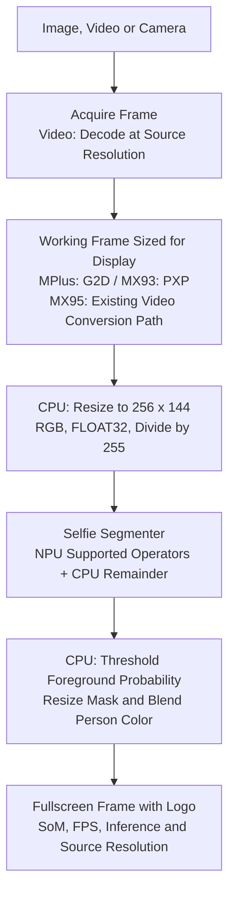

# People Segmentation

[Documentation](README.md) · [People and Vehicle Segmentation](segmentation.md)

This experimental demo paints a person/background mask with the lightweight
MediaPipe Selfie Segmenter landscape network. It is a real segmentation model,
not a filled detection box. It does not paint cars, identify people or provide
separate instance masks. Its portrait-oriented model should be evaluated on
your scene, especially for small, distant people.

## Running the Demo

Choose **AI / ML > People Segmentation > Image, Video or Camera**.
Video mode offers the supplied City Selfie clip in HD and Full HD. Camera mode
offers the same configured capture resolutions as the other AI demos.
The fullscreen view includes the Variscite logo, SoM, aligned inference/FPS
values and source resolution. Esc returns to the menu.

From `/opt/var-demos/ai-ml/camera-vision`:

```sh
python3 demo.py --task people --image media/segmentation-image.jpg
python3 demo.py --task people --video assets/videos/face_1117992_1280x720.mp4
python3 demo.py --task people --camera /dev/video0 --resolution 1280x720
```

Use `.avi` on MX93 and `/dev/video4` for the MPlus camera. The menu handles
these differences. The foreground threshold defaults to 0.5.

## Model Source and Interfaces

| Detail | All Three SoMs |
| --- | --- |
| Model | MediaPipe Selfie Segmenter, landscape |
| Source | NXP demo assets, `models/selfie_segmenter_landscape_int8.tflite` |
| Pinned revision | `0dae5d8f308bcca514d215fb3b7bc0980cc0c6d9` |
| Input | FLOAT32 RGB `[1,144,256,3]`, normalized as `pixel / 255` |
| Output | FLOAT32 foreground probabilities `[1,144,256,1]` |
| Quantization | Quantized internal network; FLOAT32 input/output despite the source filename's `int8` suffix |
| License | Apache-2.0, as attributed in NXP's model list; installed with the model |

The [pinned NXP model list](https://github.com/nxp-imx-support/nxp-demo-experience-assets/blob/0dae5d8f308bcca514d215fb3b7bc0980cc0c6d9/models/README.md)
identifies the MediaPipe origin and license. The exact
[source artifact](https://github.com/nxp-imx-support/nxp-demo-experience-assets/blob/0dae5d8f308bcca514d215fb3b7bc0980cc0c6d9/models/selfie_segmenter_landscape_int8.tflite)
is shared by all three targets. No local retraining or requantization was done.

| SoM | Preparation | Runtime |
| --- | --- | --- |
| i.MX 8M Plus | Original source renamed `people.tflite` | VX / VIP8000, graph prepared at startup |
| VAR-SOM-MX93 | Vela 3.12.0, target Ethos-U65-256 | Ethos-U delegate; boundary quantize/dequantize on CPU |
| DART-MX95 | Neutron Converter 3.1.2, target imx95 | Neutron delegate; five delegated partitions with remaining CPU operations |

The MX95 converter matches the tested 3.1.2 driver/microcode. Its remaining
operators include multiplication, quantization, slicing and padding. A
delegated partition count is not a percentage of execution time. The runner
requires NPU delegation and uses two CPU threads with automatic CPU delegates
disabled for this model.

## Conversion

Save the source as `selfie-landscape-int8.tflite`, then compile on the matching
toolchain. The installer downloads the already compiled artifacts.

```sh
vela selfie-landscape-int8.tflite --accelerator-config ethos-u65-256 --output-dir compiled
neutron-converter --input selfie-landscape-int8.tflite --output selfie-landscape-neutron.tflite --target imx95 --dump-statistics-file
```

| Installed File | SHA-256 |
| --- | --- |
| `people.tflite` | `8b3de305a6b0f35bc533cd6b46557804b915c8dff0efcc98310c96125b22f66a` |
| `people_vela.tflite` | `ecbd64095abc39c0d2aefb27219aa05f39897fab6f38c61b9f5456460b37f6a3` |
| `people_neutron.tflite` | `f28d907032c04bc67b6b04a95e6f5f257722803873737cbb5166d2dae14c718a` |

## Frame Flow



HD files remain 1280x720 and Full HD files remain 1920x1080, both at 25 FPS.
The MPlus/MX93 video paths reduce decoded frames to an 800x450 working image
for the 800x480 display; model input is always 256x144. MX93 uses a converted
MJPEG AVI copy with the same dimensions, duration and frame rate. These are
video-source resolutions, not inference tensor resolutions.

## Measured Video Results

Repeated complete City Selfie runs on the connected SoMs, HD followed by
Full HD, with an 800x480 display:

| SoM | Source | Average FPS | Mean Inference | Elapsed | Peak Sampled SoC |
| --- | --- | ---: | ---: | ---: | ---: |
| MPlus | HD | 11.11 | 4.42 ms | 55.73 s | 81.0 C |
| MPlus | Full HD | 7.30 | 4.50 ms | 86.58 s | 82.0 C |
| MX93 | HD | 24.35 | 2.73 ms | 41.26 s | 63.85 C |
| MX93 | Full HD | 24.38 | 2.82 ms | 41.28 s | 66.35 C |
| MX95 | HD | 24.43 | 4.51 ms | 41.48 s | 86.29 C |
| MX95 | Full HD | 20.44 | 4.15 ms | 49.73 s | 92.46 C |

MPlus triggered the application's 15 FPS thermal limit and cooling pauses;
the averages include those pauses. Peak sampling can miss a threshold crossing.
MX95 Full HD had additional pipeline cost despite its short inference time.
These are complete-clip checks, not long-duration stability certification or
a controlled hardware ranking. The source is 25 FPS, so 30 FPS is not claimed.
Earlier DeepLab measurements used a different clip and cannot be treated as
an exact end-to-end speedup comparison.

The tested kernels were MPlus 6.6.144, MX93 6.6.138 and MX95 6.18.20.
Our target is the latest official Yocto release for each SoM; compatibility
must be checked after a BSP change. An installer update does not update the BSP.
