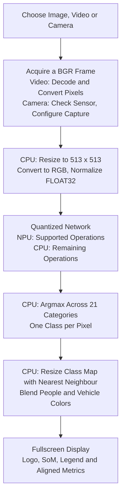

# People and Vehicle Segmentation

[Documentation](README.md) · [SoM Support](som-support.md)

This experimental demo paints people and vehicles with translucent masks.
It uses **semantic segmentation**: each pixel receives a category. Two people
share the same color; there are no independent instance masks, identities or
tracking numbers. This is not YOLO-seg or face detection.

## Running the Demo

Update the suite, run `var-demos`, then choose **AI / ML**. Segmentation's
image, video and camera entries follow the face demos on MPlus and MX93.
The image is a frame extracted at two seconds from your City Selfie clip.
Videos reuse your Buildings A/B clips in HD or Full HD. Camera mode offers
the SoM's configured OV5640 capture resolutions.

People use the existing person color. Vehicles use the existing car color.
Vehicles include cars, buses, bicycles, motorbikes and trains. The legend
stays fixed; background and unrelated categories are not painted.
The header uses the player's official logo and identifies the SoM.
Inference, FPS and source dimensions start in one fixed value column.

From `/opt/var-demos/ai-ml/camera-vision`:

```sh
python3 demo.py --task segmentation --image media/segmentation-image.jpg
python3 demo.py --task segmentation --camera /dev/video0 --resolution 1280x720
```

MPlus uses `/dev/video4`. For video, pass `--video` with an installed
Buildings MP4 path on MPlus or MJPEG AVI path on MX93. The menu supplies
the correct path automatically. Press Esc to return. An absent native camera
is checked before loading models and produces a short notice, not a traceback.

## Model and Platform Support

| Detail | Selected Model |
| --- | --- |
| Network | DeepLabV3 with MobileNetV2, depth multiplier 0.5 |
| Categories | PASCAL VOC: 20 object classes plus background |
| Input | FLOAT32 RGB `[1,513,513,3]`, normalized as `(pixel - 127.5) / 127.5` |
| Output | FLOAT32 scores `[1,513,513,21]`, not boxes or object counts |
| Quantization | Quantized internal network; measured boundary tensors are FLOAT32, not INT8 |
| Source | NXP's [DeepLab distribution](https://huggingface.co/nxp/deeplabv3-imx), revision `734686813a951c13343ca36966115a2645762523` |
| Original | Pre-quantized TensorFlow Hub artifact identified in NXP's recipe |
| Licenses | Model: Apache-2.0; NXP example code: MIT. Both license files are installed. |

| SoM | Preparation and Runtime | Current Status |
| --- | --- | --- |
| i.MX 8M Plus | Original source, graph prepared at runtime by VX; VIP8000 plus remaining CPU operations | Experimental; image, HD/Full HD video and camera checked |
| VAR-SOM-MX93 | Same source compiled with Vela 3.12.0 for Ethos-U65-256; Ethos-U delegate plus remaining CPU operations | Experimental; image, HD/Full HD video and camera checked |
| DART-MX95 | NXP publishes SDK 3.1.3/3.2.1 variants; connected driver/microcode is 3.1.2 | Not enabled: the 3.1.3 trial reported a microcode mismatch |

MPlus and MX93 share the same source weights. Neither boundary dtype nor a
`.tflite` suffix proves that the complete graph executes on the NPU. The
runner disables automatic CPU delegates when checking NPU delegation;
unsupported operations still use TFLite CPU kernels.

MX95's issue is compiler/runtime alignment, not evidence that its hardware
is too weak. A compatible 3.1.2 conversion, or a separately validated BSP
update, is required before advertising Neutron support. Do not replace
system drivers merely to launch this demo.

## Frame Processing Flow



MPlus video uses the BSP H.264 decoder and G2D conversion/scaling. MX93
uses CPU MJPEG decoding and PXP conversion/scaling. The same image engines
reduce camera working frames before CPU preprocessing. Image-file reading,
final model preparation, class selection, blending and UI drawing use the CPU.

The mask belongs to the exact frame passed to the model, not a later frame.
Nearest-neighbour resizing preserves class IDs. The roughly 21 MiB score
tensor uses a temporary NumPy view; only an independent class mask survives
the function. No tensor view remains during the next invocation. This avoids
large per-frame output copies and duplicate validation scans.

Capture/source resolution is independent of the 513x513 model and 800x480
display. The resolution panel reports source dimensions, not a reduced
working frame. Thermal policy is shared with other inference demos.

## Conversion and Reproduction

The source is `original_model/deeplabv3_quant.tflite` in the pinned NXP
revision above. The public installer asset is that identical file renamed
`deeplabv3.tflite`. MX93 compilation used BSP Vela **3.12.0**:

```sh
vela deeplabv3_quant.tflite --accelerator-config ethos-u65-256 --output-dir output
```

The generated `deeplabv3_quant_vela.tflite` is installed as
`deeplabv3_vela.tflite`. NXP's newer recipe targets U65-512; our SoM is
U65-256, so the recipe was not copied unchanged. No training or new
quantization was performed here.

<details>
<summary>Recorded SHA-256 Checksums</summary>

```text
e993b00474b75da6b424da30bc1e548305b397ea43a8facf20365c06165123ab  deeplabv3.tflite
31ed07a6789bb618c81c82dc4cab3d09c4fe052cbc4aa1123819415deae3cc86  deeplabv3_vela.tflite
6e19835442a4713c18235d50031776f0aca1dca6fb7a7098c744f1663b1e31fa  segmentation-image.jpg
```

</details>

Models and the sample frame are delivered through checksum-verified asset
manifests. The original user video is not changed or relabeled as an
independently verified public-domain image.

## Validation and Limitations

The portrait produced a person mask on both NPUs, covering about 25% of its
viewport. Buildings A produced people and vehicle masks in HD and Full HD.
Camera capture and visible drawing were checked on both SoMs; the current
camera scene need not contain either category.

Initial short visible video runs measured about **1.3 FPS** on MPlus and
**4.1 FPS** on MX93. Model invocation alone was approximately 557 ms and
90 ms respectively. Avoiding score copies improved an MX93 HD retest to
4.75 FPS; its HD camera check reached 5.51 FPS. These are different short
runs, not controlled accuracy or sustained-performance benchmarks.
HD/Full HD support does **not** imply 25 or 30 FPS.

Complete Buildings A HD checks with the published assets reached **1.15 FPS**
on MPlus and **4.89 FPS** on MX93. MPlus reached 82 C, paused for application
cooling and resumed; its FPS includes the pause. MX93 peaked at 62.35 C and
completed without cooling. Segmentation remains experimental, not a real-time
25 or 30 FPS demo or a sustained-performance guarantee.

The model can mislabel pixels, miss small vehicles and produce unstable
boundaries. Masks are predictions, not ground truth. The portrait also
produced some vehicle-class false positives. No all-frame accuracy,
instance separation, object counting or identity inference is claimed.
See the [validation record](validation.md) for test scope and current issues.

## Related Guides

- [Model Sources and Conversion](model-conversion.md)
- [Video Sources](video-sources.md)
- [VIP8000](npus/vip8000.md) and [Ethos-U65](npus/ethos-u65.md)
- [Face Detection](face-detection.md), a different task
