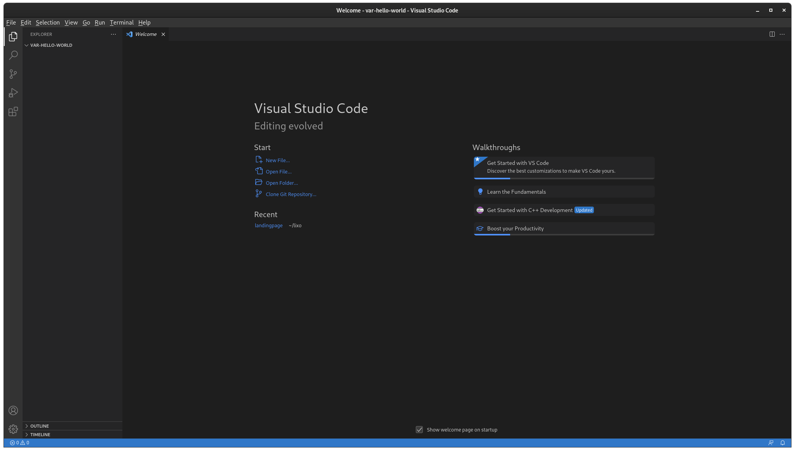
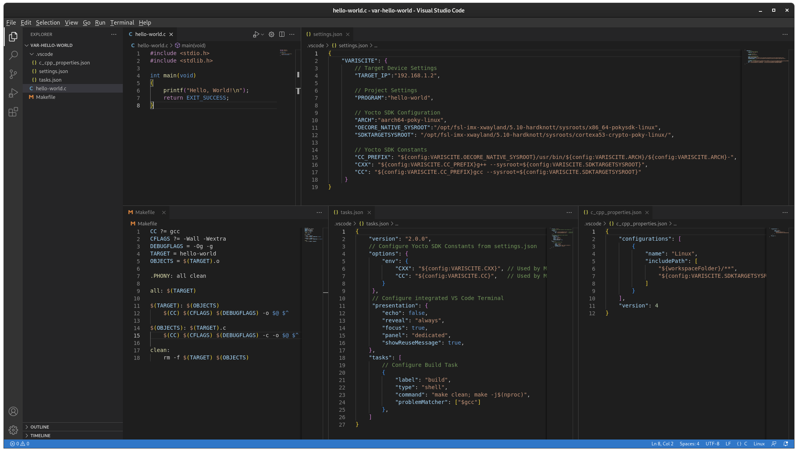
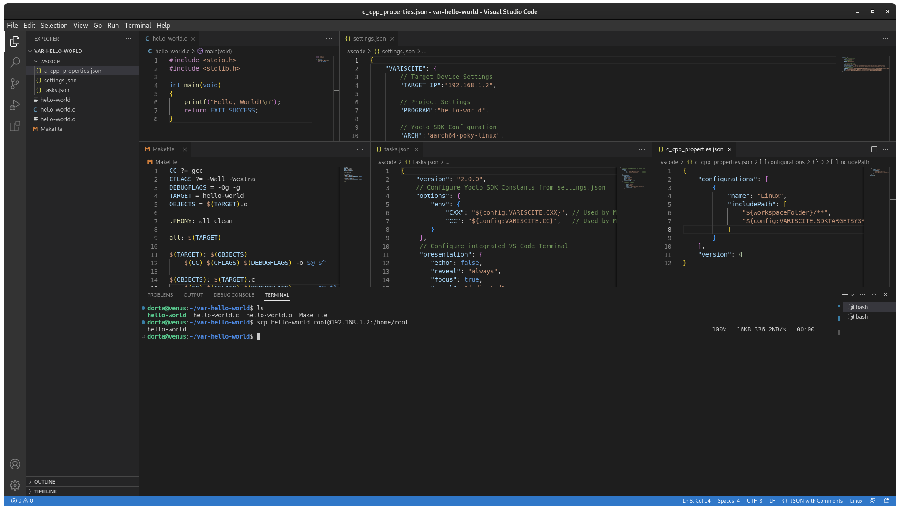
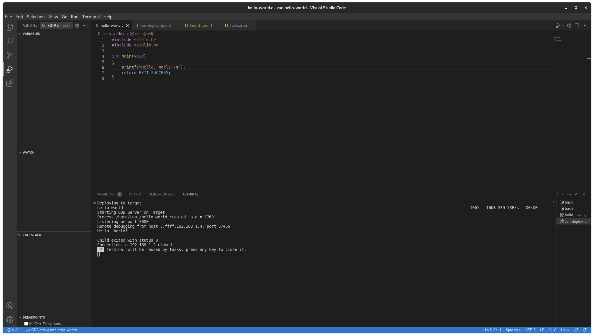

# Yocto Programming with Visual Studio Code

Visual Studio Code (VS Code) provides developers with a robust, contemporary,
open-source code editor, making the creation and debugging of C/C++ applications
on Variscite System on Modules a seamless experience.

This guide revolves around the utilization of the feature-laden VS Code for
developing and debugging C applications. To deepen understanding and gain access
to supplementary resources, please visit the Yocto Programming with VS Code page
on the Variscite Wiki:

* [DART-MX8M-PLUS - Kirkstone (Kernel 5.15.71) - Tutorial](https://variwiki.com/index.php?title=Yocto_Programming_with_VSCode&release=mx8mp-yocto-kirkstone-5.15.71_2.2.0-v1.1)

Before starting, make sure to follow the instructions at the Variscite Wiki
page:

* [DART-MX8M-PLUS - Kirkstone (Kernel 5.15.71) - Yocto Build](https://variwiki.com/index.php?title=Yocto_Build_Release&release=mx8mp-yocto-kirkstone-5.15.71_2.2.0-v1.1)

Even tought this guide focus on the `Kirkstone Kernel 5.15.71` release for the
[DART-MX8M-PLUS](https://variwiki.com/index.php?title=DART-MX8M-PLUS), all the
procedures and resources are compatible and applicable with other Variscite
modules.

## 1. Creation of the Root File System with VS Code Debug Support

To enable debugging with VS Code, it's necessary to have a preferred SSH server
(such as openssh or dropbear), gdb, and gdbserver installed on the target
device. The following steps outline the setup:

**1.1** Open the `conf/local.conf` file in your Yocto build directory.

**1.2** Append the following lines to the file:

```bash
EXTRA_IMAGE_FEATURES = " \
	tools-debug \
	ssh-server-dropbear \
"
```
This configuration adds the necessary image features for debugging and
installs the dropbear SSH server.

**1.3** Save the file and build the Yocto image using the `bitbake` command.

With these configurations, the rootfs now has all the necessary components to
support debugging with VS Code.

**Note**: Only rebuild if these packages are not installed or functional on
the system, otherwise there is no need to rebuild the Yocto image.

## 2. Setting Up the Host Computer Environment

To ensure a smooth VS Code debugging experience on a fresh Ubuntu 20.04
installation, the following detailed instructions are to be adhered to. The
process begins with the installation of required dependencies:

**2.1** Install the GNU/Linux Packages

```bash
sudo apt update
sudo apt install build-essential gdb gdb-multiarch git
```

**2.2** Install VS Code

```bash
sudo snap install --classic code
```

**2.3** Install VS Code Extensions

VS Code offers a user-friendly interface for the installation and management
of extensions. For further insight into this process, see the documentation
below:

* [Using extensions in Visual Studio Code](https://code.visualstudio.com/docs/introvideos/extend)
* [Extension Marketplace](https://code.visualstudio.com/docs/editor/extension-marketplace)

For the purpose of this guide, the necessary extensions are installed through
the command line with the following command:

```bash
code --install-extension ms-vscode.cpptools
```

**2.4** Install Yocto Toolchain

To facilitate cross-compilation of applications, it is essential to install
the Yocto Toolchain. For more information, please refer to the following
Variscite wiki page:

* [Yocto Toolchain Installation for out of Yocto Builds](https://variwiki.com/index.php?title=Yocto_Toolchain_installation&release=mx8mp-yocto-kirkstone-5.15.71_2.2.0-v1.1)

To compile applications that require libraries other than `glibc` you should
build an SDK which contains development versions of all libraries in the
rootfs image, and not just the basic toolchain.

Follow these steps to install the toolchain and ensure proper configuration
for VS Code debugging.

**2.4.1** Build a Complete SDK

```bash
cd ~/var-fsl-yocto
MACHINE=imx8mp-var-dart DISTRO=fslc-xwayland . var-setup-release.sh build_xwayland
```

**2.4.2** Populate the SDK

```bash
bitbake -c populate_sdk fsl-image-gui
```

**Note**: The SDK should match the rootfs image on the target, otherwise you may
experience difficulties when trying to debug application failures.

**2.4.3** Install the toolchain/SDK/tool
    
```bash
tmp/deploy/sdk/<toolchain>.sh
```

**Note**: The toolchain/script name depends on your build machine and the
bitbaked image/recipe.

**2.4.4** Accept all the default options, and at the end of the installation
you should see the following:

```bash
SDK has been successfully set up and is ready to be used.
```

## 3. Create, Cross-compile, and run a new "Hello, World!" project

Check the `hello-world` example at the following link:

* [var-demos/vscode-demos/hello-world](https://github.com/varigit/var-demos/tree/master/vscode-demos/hello-world)

**3.1** Open a new terminal, create an empty project directory and open VS Code:

```bash
mkdir ~/var-hello-world
cd ~/var-hello-world
code .
```
This launches VS Code with **~/var-hello-world** as working directory, which
is currently empty:



**3.2** Next, create the following files:

| File                             | Description                                                                                     |
| -------------------------------- | ----------------------------------------------------------------------------------------------- |
| `hello-world.c`                  | Source code for the demo program `hello-world`                                                  |
| `Makefile`                       | Makefile to cross compile `hello-world.c` to `hello-world`                                      |
| `.vscode/settings.json`          | VS Code file to configure global environment variables for the SDK/toolchain                    |
| `.vscode/tasks.json`             | VS Code file to override or add new tasks. Runs Makefile when VS Code build command is executed.|
| `.vscode/c_cpp_properties.json`  | VS Code file to configure include path for IntelliSense                                         |


**3.3** Create a new file called [hello-world.c](https://github.com/varigit/var-demos/blob/master/vscode-demos/hello-world/hello-world.c):

**Note**: To create a new file or folder in VS Code, right click in the VS Code
explorer view and select `New File` or `New Folder`.

```c
#include <stdio.h>
#include <stdlib.h>

int main(void)
{
    printf("Hello, World!\n");
    return EXIT_SUCCESS;
}
```

**3.4** Create a new [Makefile](https://github.com/varigit/var-demos/blob/master/vscode-demos/hello-world/Makefile)
file to build `hello-world` binary:

```Makefile
CC ?= gcc
CFLAGS ?= -Wall -Wextra
DEBUGFLAGS = -Og -g
TARGET = hello-world
OBJECTS = $(TARGET).o

.PHONY: all clean

all: $(TARGET)

$(TARGET): $(OBJECTS)
    $(CC) $(CFLAGS) $(DEBUGFLAGS) -o $@ $^

$(OBJECTS): $(TARGET).c
    $(CC) $(CFLAGS) $(DEBUGFLAGS) -c -o $@ $^

clean:
    rm -f $(TARGET) $(OBJECTS)
```

**3.5** Create a new folder named **.vscode**. Then, create a new file
[.vscode/settings.json](https://github.com/varigit/var-demos/blob/master/vscode-demos/hello-world/.vscode/settings.json):
   
```bash
{
	"VARISCITE": {
    	// Target Device Settings
    	"TARGET_IP":"192.168.1.2",

    	// Project Settings
    	"PROGRAM":"hello-world",

    	// Yocto SDK Configuration
    	"ARCH":"aarch64-poky-linux",
    	"OECORE_NATIVE_SYSROOT":"/opt/fsl-imx-xwayland/5.10-hardknott/sysroots/x86_64-pokysdk-linux",
    	"SDKTARGETSYSROOT": "/opt/fsl-imx-xwayland/5.10-hardknott/sysroots/cortexa53-crypto-poky-linux/",

    	// Yocto SDK Constants
    	"CC_PREFIX": "${config:VARISCITE.OECORE_NATIVE_SYSROOT}/usr/bin/${config:VARISCITE.ARCH}/${config:VARISCITE.ARCH}-",
    	"CXX": "${config:VARISCITE.CC_PREFIX}g++ --sysroot=${config:VARISCITE.SDKTARGETSYSROOT}",
    	"CC": "${config:VARISCITE.CC_PREFIX}gcc --sysroot=${config:VARISCITE.SDKTARGETSYSROOT}"
   	 }
}
```

The table below describes the global variables in settings.json. They can be
accessed in other json files, for example `${config:VARISCITE.TARGET_IP}`:

| Variable               | Description                                                                                                                                                 |
| ---------------------- | ----------------------------------------------------------------------------------------------------------------------------------------------------------- |
| TARGET_IP              | The IP Address of the DART-MX8M-PLUS target device                                                                                                          |
| PROGRAM                | Must match the name of the binary generated by Makefile                                                                                                     |
| ARCH                   | Architecture prefix for gcc, g++, gdb, etc. Align with CXX variable set by /opt/fslc-xwayland/5.10-hardknott/eenvironment-setup-cortexa53-crypto-poky-linux |
| OECORE_NATIVE_SYSROOT  | Align with OECORE_NATIVE_SYSROOT variable set by /opt/fslc-xwayland/5.10-hardknott/environment-setup-cortexa53-crypto-poky-linux                            |
| SDKTARGETSYSROOT       | Align with SDKTARGETSYSROOT variable set by /opt/fslc-xwayland/5.10-hardknott/environment-setup-cortexa53-crypto-poky-linux                                 |
| CC_PREFIX              | Full path to toolchain gcc, g++, etc binaries                                                                                                               |
| CXX                    | Path to cross g++ binary and sysroot                                                                                                                        |
| CC                     | Path to cross gcc binary and sysroot                                                                                                                        |


**3.6** Create a new file `.vscode/tasks.json`. The [tasks.json](https://github.com/varigit/var-demos/blob/master/vscode-demos/hello-world/.vscode/tasks.json)
has three root objects:

```json
{
    "version": "2.0.0",
    // Configure Yocto SDK Constants from settings.json
    "options": {
        "env": {
            "CXX": "${config:VARISCITE.CXX}", // Used by Makefile
            "CC": "${config:VARISCITE.CC}",   // Used by Makefile
        }
     },
     // Configure integrated VS Code Terminal
     "presentation": {
        "echo": false,
        "reveal": "always",
        "focus": true,
        "panel": "dedicated",
        "showReuseMessage": true,
    },
    "tasks": [
        // Configure Build Task
        {
            "label": "build",
            "type": "shell",
            "command": "make clean; make -j$(nproc)",
            "problemMatcher": ["$gcc"]
        },
    ]
}
```

**3.7** Create [.vscode/c_cpp_properties.json](https://github.com/varigit/var-demos/blob/master/vscode-demos/hello-world/.vscode/c_cpp_properties.json)
to configure the include path for IntelliSense:

```json
{
    "configurations": [
        {
            "name": "Linux",
            "includePath": [
                "${workspaceFolder}/**",
                "${config:VARISCITE.SDKTARGETSYSROOT}/usr/include/**"
            ]
        }
    ],
    "version": 4
}
```

**3.7.1** The workspace should look similar to this:



**3.8** Cross compile the project by selecting `Terminal` -> `Run Build Task`
or entering `Ctrl+Shift+B` and selecting `Build`.

**3.9** Open a new VS Code terminal by selecting `Terminal` -> `New Terminal`.
Then, deploy the `hello-world` binary to the target device using `scp` command:

```bash
$ scp hello-world root@<ip addr>:/home/root/
```



**3.10** Launch `hello-world` on the target device:

```bash
# ./hello-world
Hello, World!
```

### 4. Remote Debugging with VS Code

After verifying `hello-world` runs on the target device, now setup VS Code for
remote debugging. The working directory should currently have these files:

```bash
variscite@ubuntu:~/var-hello-world$ find
.
./Makefile
./.vscode
./.vscode/c_cpp_properties.json
./.vscode/settings.json
./.vscode/tasks.json
./hello-world.c
./hello-world
```

To enable debugging, edit `.vscode/tasks.json` to add a `var-deploy-gdb`
debug task and add two additional files to the project:

| File/Script             | Description                                                                      |
| ------------------------| ---------------------------------------------------------------------------------|
| var-deploy-gdb.sh       | Generic script to deploy and launch gdbserver                                    |
| .vscode/launch.json     | VS Code file to configure debug settings. Runs var-build-and-debug in tasks.json |
| .vscode/tasks.json      | Edit to call var-deploy-gdb.sh prior to debugging.                               |

**4.1** Create [var-deploy-gdb.sh](https://github.com/varigit/var-demos/blob/master/vscode-demos/hello-world/var-deploy-gdb.sh) file:

First, add a generic script deploy a program and launch gdbserver. The script
requires two arguments:

* **TARGET_IP**: The IP address of the target device;
* **PROGRAM**: The name of the binary executable, hello-world in this example.

In the end, tasks.json runs this script at the beginning of each debug session:

```bash
#!/bin/bash
readonly TARGET_IP="$1"
readonly PROGRAM="$2"
readonly TARGET_DIR="/home/root"

# Must match startsPattern in tasks.json
echo "Deploying to target"

# kill gdbserver on target and delete old binary
ssh root@${TARGET_IP} "sh -c '/usr/bin/killall -q gdbserver; rm -rf ${TARGET_DIR}/${PROGRAM}  exit 0'"

# send the program to the target
scp ${PROGRAM} root@${TARGET_IP}:${TARGET_DIR}

# Must match endsPattern in tasks.json
echo "Starting GDB Server on Target"

# start gdbserver on target
ssh -t root@${TARGET_IP} "sh -c 'cd ${TARGET_DIR}; gdbserver localhost:3000 ${PROGRAM}'"
```

**4.2** Create [launch.json](https://github.com/varigit/var-demos/blob/master/vscode-demos/hello-world/.vscode/launch.json) file:

VS Code has a powerful built in debugger capable of debugging many
programming languages. This step adds a configuration for debugging using the
C/C++ extension:

```bash
{
    "version": "0.2.0",
    "configurations": [{
        "name": "GDB debug",
        "type": "cppdbg",
        "request": "launch",
        "program": "${config:VARISCITE.PROGRAM}",
        "args": [],
        "stopAtEntry": true,
        "cwd": "${workspaceFolder}",
        "environment": [],
        "console": "integratedTerminal",
        "MIMode": "gdb",
        "targetArchitecture": "arm64",
        "preLaunchTask": "var-deploy-gdb",
        "setupCommands": [{
            "description": "Enable pretty-printing for gdb",
            "text": "-enable-pretty-printing",
            "ignoreFailures": true
        }],
        "miDebuggerPath": "/usr/bin/gdb-multiarch",
        "miDebuggerServerAddress": "${config:VARISCITE.TARGET_IP}:3000",
    }]
}
```

See the table below for important details regarding `launch.json` variables:

| Parameter                | Description                                                                 |
| ------------------------ | --------------------------------------------------------------------------- |
| miDebuggerServerAddress  | Must match the IP Address of the target device                              |
| program                  | Must match the name of the binary generated by the Makefile                 |
| preLaunchTask            | Must match the name of the task in .vscode/tasks.json in the following step |

**4.3** Modify the [tasks.json](https://github.com/varigit/var-demos/blob/master/vscode-demos/hello-world/.vscode/tasks.json) file:

In launch.json, it was created a preLaunchTask to run a task named `var-deploy-gdb`
at the beginning of each debugging session. This task is configured by adding
a new task var-deploy-gdb to `.vscode/tasks.json`:

```json
{
    "version": "2.0.0",
    // Configure Yocto SDK Constants from settings.json
    "options": {
        "env": {
            "CXX": "${config:VARISCITE.CXX}",
            "CC": "${config:VARISCITE.CC}",
        }
     },
     // Configure integrated VS Code Terminal
     "presentation": {
        "echo": false,
        "reveal": "always",
        "focus": true,
        "panel": "dedicated",
        "showReuseMessage": true,
    },
    "tasks": [
        // Configure launch.json (debug) preLaunchTask Task
        {
            "label": "var-deploy-gdb",
            "isBackground": true,
            "problemMatcher":{
                "base": "$gcc",
                "background": {
                    "activeOnStart": true,
                    "beginsPattern":  "Deploying to target",
                    "endsPattern":  "Starting GDB Server on Target"
                }
            },
            "type": "shell",
            "command": "sh",
            "args": [
                "var-deploy-gdb.sh",
                "${config:VARISCITE.TARGET_IP}",
                "${config:VARISCITE.PROGRAM}"
            ],
            "dependsOn": ["build"],
        },
        // Configure Build Task
        {
            "label": "build",
            "type": "shell",
            "command": "make clean; make -j$(nproc)",
            "problemMatcher": ["$gcc"]
        },
    ]
}
```

The following table summarizes the `var-deploy-gdb` configuration in `tasks.json`:

| Parameter  | Description                                                              |
| ---------- | ------------------------------------------------------------------------ |
| label      | Must match preLaunchTask in launch.json                                  |
| type       | This task launches a shell                                            |
| command    | Launch sh, with arguments var-build-and-debug.sh 192.168.1.2 hello-world |

**4.4** Launch a Debugging Session

After following the steps above, the working directory should now have these files:

```bash
~/var-hello-world$ find
.
./Makefile
./.vscode
./.vscode/c_cpp_properties.json
./.vscode/settings.json
./.vscode/tasks.json
./.vscode/launch.json
./var-deploy-gdb.sh
./hello-world.o
./hello-world.c
./hello-world
```

A new debugging session can be started by selecting `Run` -> `Start Debugging`
or by pressing `F5` on the keyboard. VS Code switches to the debug perspective
and launch a gnome-terminal running gdbserver on the target device:



## 5. Example Project Source Code

The source code for this example is available from Variscite's Github repository:

```bash
$ git clone https://github.com/varigit/var-demos
$ cd var-demos/vscode-demos/hello-world
```

**5.1** Launch VS Code

```bash
code .
```

Configure the target device IP Address and SDK variables in `.vscode/settings.json`.
Finally, start a debugging session by selecting `Run` -> `Start Debugging` or
pressing `F5` on the keyboard.
